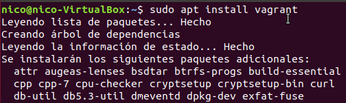
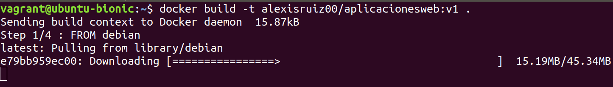
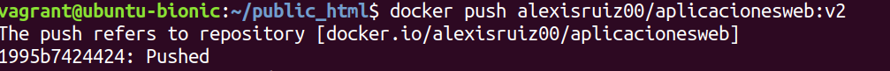
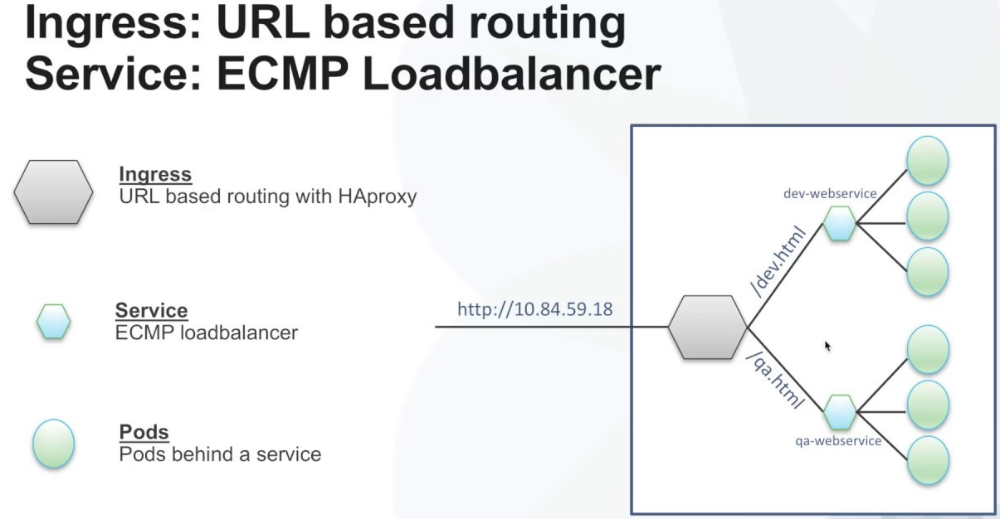
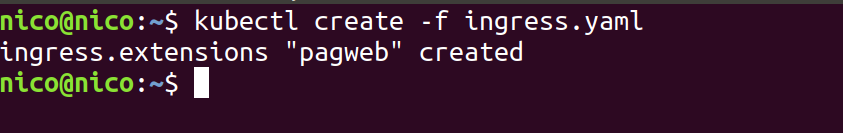

 **Project: “Cloud Computing in European schools”**  

 Number: Project: 2017-1-ES01-KA202-038471

   

# Introduction to PaaS: develop, deploy, run and manage apps on the Cloud  

#### Disclaimer
&nbsp;&nbsp;&nbsp;  *"The European Commission support for the production of this publication does not constitute an endorsement of the contents which reflects the views only of the authors, and the Commission cannot be held responsible for any use which may be made of the information contained therein."*

#### Author

&nbsp;&nbsp;&nbsp;  This material has been produced by Nico Fernández, Miguel Rodríguez, Alexis Ruiz under the Creative Commons licence:    

### Objective
&nbsp;&nbsp;&nbsp; Platform as a Service (PaaS), is a cloud computing model that allows the users to develop, deploy, run and manage applications without taking care about the underlying layers. The alternatives used today focus on the use of containers which promote the **microservices based application** development approach (vs **monolithic applications**), because the different services into which we the application is separated can easily run in different containers. We will make a study of Docker, Kubernetes and OpenShift in order to develop, deploy, run and manage  microservices based applications.

&nbsp;&nbsp;&nbsp;This activity has been developed for developing the professional competence includes in the Erasmus+ project "Cloud Computing in European Schools".

 
 
 

# Docker Index:

**[Docker installation: virtual machine managed by Vagrant](#1).**

> **[1- Vagrant and Docker Installation](#2):**
>
> **[2- Docker applications lifecycle:](#3)**
>
> **[3- Docker containers: not persistent](#4):**
 
 
 

 
 
 

# Kubernetes Index:

**[KUBERNETES](#1k).**

> **[1- Introduction](#2k):**
>
> **[2- Installation & Start](#3k)**
>
> **[3- Working with minikube](#4k):**
 
 
 

# Docker installation: virtual machine managed by Vagrant.

The first step of our installation of docker is to have already installed the virtual machine manager called Vagrant. **But what is Vagrant?**

**Vagrant** is a tool for building and managing virtual machine environments in a single workflow. With an easy-to-use workflow and focus on automation, Vagrant lowers development environment setup time, increases production parity, and makes the "works on my machine" excuse a relic of the past. Machines are provisioned on top of VirtualBox, VMware, AWS, or any other provider.

The main commands for Vagrant are:

1.  **vagrant box add …** → download image / box from Vagrant repository. Example: vagrant box add ubuntu/bionic64 --provider virtualbox --\> download an image (box) of Ubuntu version Bionic 64 bits for VirtualBox.

2.  **vagrant box list** → list all downloaded images / boxes.

3.  **mkdir FOLDER** → create folder where we will create the Vagrantfile file that will contain the definition of the MV.

4.  **cd FOLDER** → go in inside the folder.

5.  **vagrant init BOX** → The MV files are located in the directory where the hypervisor (VirtualBox, VMWare ...) stores its MVs. In FOLDER, the VagrantFile file, a log file and a hidden .vagrant folder will be saved. Example: vagrant init ubuntu/bionic64 --\> the box used is ubuntu bionic 64.

6.  **vagrant up** → start the MV --\> We can check the virtual machine running by open the VirtualBox app.

7.  **vagrant ssh** → connect to the MV

8.  **vagrant halt** → stop the MV

So now you must be very concentrated to follow this steps:

 
 
 

# 1- Vagrant and Docker Installation: 

1º Step:

We must create a workspace for Vagrant where the configuration file of Vagrant is going to be there (Vagrantfile describes the type of machine , and how to configure and provision it).Then we are going to create a directory where we are going to “UP” the boxes(images ).

The Vagrantfile must be created in vagrant folder and must contains this configuration: (Upload Vagrantfile)

At the end of this file we can see how it is configured to install docker in the box that will be downloaded later

2º Step:

> ***-- sudo apt install vagrant***

#### 

#### 3º Step:

####  Install VirtualBox:

> ***-- sudo apt install virtualbox***

4º Step:

Get an image from Vagrant web:

> ***-- vagrant box add ubuntu/bionic64 --provider virtualbox***

*(This is the box (image) that it is going to be use as basis to install docker)*

5º Step:

Checking that everything has worked correctly:

> ***-- vagrant box list***

6º Step:

With the following command, the ubuntu box downloaded will be started applying the Vagrantfile configuration

> ***-- vagrant up***

7º Step

Finally, we can access to the created box by ssh connection and check if docker is been successfully installed.

SSH connection:

> ***-- vagrant ssh***

 
 
 

# 2- Docker applications lifecycle:

After installing an environment with Docker, we are going to develop Docker images and deploy containers to run our applications.

1º Step:

First of all we are going to create a directory called “public\_html” and inside of it we need to create an other thing, a web page called “index.html”. It will be served by a web server that will run in a Docker container.

2º Step:

Now we need to create a docker image, but before doing that, we are going to create a Dockerfile in which define the following instructions that will be executed in the moment of building the docker image:

-   Update repositories and install Apache2

-   Clean and remove packages

-   Copy our webpage to the public directory of Apache (/var/www/html).

> Dockerfile must be created in the vagrant fold of /home

3ºStep:

Create the docker image. using the following command:

> ***-- docker build -t accountName/aplicacionesweb:v1***

And use this command to see which images you have:

> ***-- docker image ls***

4ºStep

Upload our docker image to a repository in Dockerhub ([hub.docker.com](https://hub.docker.com/))

Log in our dockerhub account:

> ***-- docker login***

Upload the docker image to a repository in our account:

> ***-- docker push accountName/repositoryName:”imageName”***

5ºStep

 

  Download a docker image from dockerhub:

> ***-- docker pull accountName/repositoryName:”imageName”***

6º Step

Run a container from the downloaded image:

> **-- docker run --name “containerName” -d -p “ports” accountName/repositoryName:”imageName”**

7º Step

Connect locally using links browser (text browser) and check the web page:

8º Step

Modify the application:

For every new version we create, we need to follow this steps:

8.1º Step

Create the new image (in the development environment).

> ***-- docker build -t accountName/aplicacionweb:v2***

8.2º Step

Upload the new image.

> ***-- docker push accountName/aplicacionesweb:v2***

8.3º Step

Download the new image to the production environment.

> ***-- docker pull accountName/aplicacionesweb:v2***

8.4º Step

Delete the current container (in the production environment):

> ***-- docker container rm -f aplweb***

8.5º Step

Run the new container:

> ***-- docker run --name aplweb2 -d -p 80:80 accountName/aplicacionesweb:v2***

 
 
 

# 3- Docker containers: not persistent: 

This section explains the need to use persistent volumes due to data in containers are lost.

1º Step:

We are going to create a container with a MySQL server; the data is stored in a persistent volume.

> ***-- docker run --name some-mysql -v /opt/mysql:/var/lib/mysql -e MYSQL\_ROOT\_PASSWORD=asdasd -d mysql***

2º Step:

Create a database called dbtest.

> ***-- docker exec -it some-mysql bash***

> ***-- root@75544a024f9b:/\# mysql -u root -p -h localhost***

> ***-- create database dbtest;***

3º Step:

Delete the container(1º command), create a new container(2º command) and then Verify that the database is still created(3º, 4º and 5º command).

> ***-- docker container rm -f some-mysql***

> ***-- docker run --name some-mysql2 -v /opt/mysql:/var/lib/mysql -e MYSQL\_ROOT\_PASSWORD=asdasd -d mysql***

> ***-- docker exec -it some-mysql bash***

> ***-- root@75544a024f9b:/\# mysql -u root -p -h localhost***

> ***-- show databases;***

 
 
 
 
 
 
 

# **KUBERNETES**
 

# 1. Introduction
 

Nowadays, the most common scenario of an application deployment would be:

1.  A set of instances for running our app.

2.  An external load balancer for these instances.

3.  A set of databases that make persistent our app.

4.  Another load balancer that works internally between the instances and databases sets.
 
 

This deployment scenario imply a lot of configuration time and big costs. But, thanks to Kubernetes we can deploy it saving this costs.

Kubernetes its an open code system that allows the deployment, scalability, and application management in containers in an automated way.

This system can be broken down in the five following elements:

-   **Pod:** Minimum instance used in kubernetes. It will consist at least of one docker image, but can have more than one image even a database. This element is stateless and allows us to break down our full application in its differents process that will be running in differents pods that will interactuate between them.

-   **Deployment:** is the template that will instruct Kubernetes how to create the associated pods, how to boot the Docker container, how many replicas we want by default, etc.

-   **Service:** Pods are not visible neither accessible from outside themselves, for solving that is for what are the services, which act as load balancer and allows to access from outside and and inside (kubernetes node network).

-   **Volumes & Persistent volumes:** For apps which need storage.

-   **Ingress Controllers:** Redirects the traffic to the services.
 
 

# 2. Installation and start.
 

We are going to work with minikube which is an environment to use Kubernetes in our laptop without having a production environment, either to use it as a developer, or to test it.

To download Minikube and install it, use the following commands:
 

> ***curl -Lo minikube [https://storage.googleapis.com/minikube/releases/v0.30.0/minikube-linux-amd64](https://storage.googleapis.com/minikube/releases/v0.30.0/minikube-linux-amd64)***
>
> ***&& chmod +x minikube***
>
> ***&& sudo cp minikube /usr/local/bin/***
>
> ***&& rm minikube***

 

 
 
 

Same for kubectl:
 

> ***curl -Lo kubectl [https://storage.googleapis.com/kubernetes-release/release/v1.10.0/bin/linux/amd64/kubectl](https://storage.googleapis.com/kubernetes-release/release/v1.10.0/bin/linux/amd64/kubectl)***
>
> ***&& chmod +x kubectl***
>
> ***&& sudo cp kubectl /usr/local/bin/***
>
> ***&& rm kubectl***
 
 

 
 
 

Start the virtual machine with minikube (this step start the installation of the cluster).
 

> ***-- minikube start --vm-driver=virtualbox***

 
 
 

For checking the installation we can use this command:

***-- kubectl get nodes***

 

 
 
 

Last step, add the component ingress:
 
 
***-- minikube addons enable ingress***

 

 
 

# 3. Working with minikube

## 3.1 Fault tolerance

Let's see how minikube automatically deploys pods when anyone of the running pods fails.
First, create a pod from a dockerhub image

> ***-- kubectl run pagweb --image alexisruiz00/aplicacionesweb:v1***

 
 

Once the pod is running, let’s delete it to see how minikube instantly deploys a new pod.

> ***-- kubectl get pods***

> ***-- kubectl delete pod/pagweb-59dc644f4d-cqlrn***

The resource Deployment can be also checked:

> ***-- kubectl get deploy***

## 3.2 Scalability

The amount of running pods can be increased whenever it is needed just using this command:

> ***-- kubectl scale deploy “deployName” --replicas=”amountWanted”***

For checking it:

> ***-- kubectl get pod -o wide***

 
 
 
 

## 3.3 Load Balancing

Minikube distributes the workload between all the pods.

To see it, first step, create a resource Service to access to the app:

> ***-- kubectl expose deployment “deploymentName” --port=80 --type=NodePortI***

Second, get the port of the application:

> ***-- kubectl get services***

Third, get the ip of the cluster where the app is running:

> ***-- minikube ip***

Finally, try to access to the web app, and see how internally the service redirect the connection to one of the running pods. The service will be redirecting the connection to the pod with less load.

> ***-- http://”ip”:”port”***

This case:

> ***-- http://192.168.99.100:80***

 
 
 
 

## 3.4 Continuous updates

A quality of minikube, is the fact that we can make continious updates without shutting down the VM or making us run another one, with this simpy command:

> ***-- kubectl set image deployment pagweb pagweb=alexisruiz00/aplicacionesweb:v2***

 
 
 
 

## 3.5 Rollback

Minikube allows us to get previous version of the build. For this we can use this command:

> ***-- kubectl rollout undo deployment/pagweb***

 
 
 
 

## 3.6 Routing

It is possible to access to the app by a DNS name. We will use nip.io domain. It is necessary to create a file ingress.yaml.

It must contains the following information:

apiVersion: extensions/v1beta1
kind: Ingress
metadata:
  name: pagweb
spec:
  rules:
  - host: pagweb.172.22.200.165.nip.io
    http:
      paths:
      - path: /
        backend:
          serviceName: pagweb
          servicePort: 80

Create the resource ingress:

> ***-- kubectl create -f ingress.yaml***

Check it:

> ***-- kubectl get ingress***

