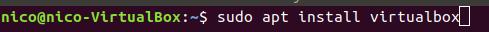
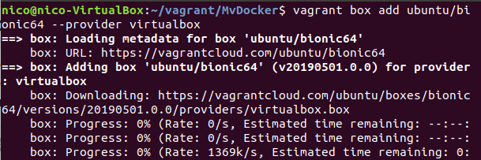

 **Project: “Cloud Computing in European schools”**  

 Number: Project: 2017-1-ES01-KA202-038471

   

### **Docker**

### **1- Docker installation: virtual machine managed by Vagrant.**

The first step of our installation of docker is to have already installed the virtual machine manager called Vagrant. **But what is Vagrant?**

**Vagrant** is a tool for building and managing virtual machine environments in a single workflow. With an easy-to-use workflow and focus on automation, Vagrant lowers development environment setup time, increases production parity, and makes the "works on my machine" excuse a relic of the past. Machines are provisioned on top of VirtualBox, VMware, AWS, or any other provider.

The main commands for Vagrant are:

1.  **vagrant box add …** → download image / box from Vagrant repository. Example: vagrant box add ubuntu/bionic64 --provider virtualbox --\> download an image (box) of Ubuntu version Bionic 64 bits for VirtualBox.

2.  **vagrant box list** → list all downloaded images / boxes.

3.  **mkdir FOLDER** → create folder where we will create the Vagrantfile file that will contain the definition of the MV.

4.  **cd FOLDER** → go in inside the folder.

5.  **vagrant init BOX** → The MV files are located in the directory where the hypervisor (VirtualBox, VMWare ...) stores its MVs. In FOLDER, the VagrantFile file, a log file and a hidden .vagrant folder will be saved. Example: vagrant init ubuntu/bionic64 --\> the box used is ubuntu bionic 64.

6.  **vagrant up** → start the MV --\> We can check the virtual machine running by open the VirtualBox app.

7.  **vagrant ssh** → connect to the MV

8.  **vagrant halt** → stop the MV

So now you must be very concentrated to follow this steps:

# 1- Vagrant and Docker Installation: 

1º Step:

We must create a workspace for Vagrant where the configuration file of Vagrant is going to be there (Vagrantfile describes the type of machine , and how to configure and provision it).Then we are going to create a directory where we are going to “UP” the boxes(images ).

The Vagrantfile must be created in vagrant folder and must contains this configuration: (Upload Vagrantfile)

At the end of this file we can see how it is configured to install docker in the box that will be downloaded later

2º Step:

> ***-- sudo apt install vagrant***

#### 

#### 3º Step:

####  Install VirtualBox:

> ***-- sudo apt install virtualbox***

4º Step:

Get an image from Vagrant web:

***vagrant box add ubuntu/bionic64 --provider virtualbox***

*(This is the box (image) that it is going to be use as basis to install docker)*

5º Step:

Checking that everything has worked correctly:

> ***-- vagrant box list***

6º Step:

With the following command, the ubuntu box downloaded will be started applying the Vagrantfile configuration

> ***-- vagrant up***

7º Step

Finally, we can access to the created box by ssh connection and check if docker is been successfully installed.

SSH connection:

> ***-- vagrant ssh***

